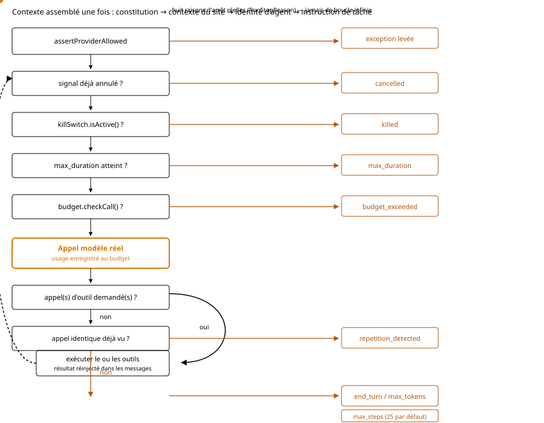
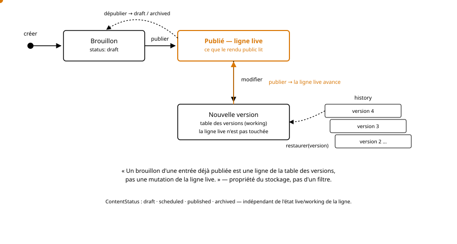
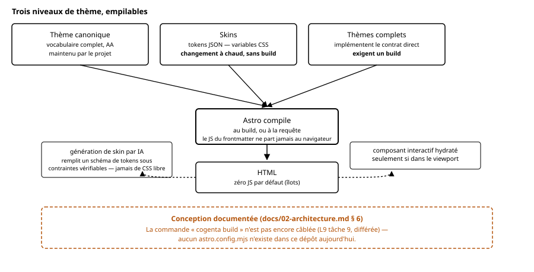

# 02 — Architecture

## 1. Principe fondateur : deux plans

Cogenta sépare strictement **le plan de contrôle** et **le plan de diffusion**.

**Plan de contrôle** — admin, API, base de données, runtime d'agents, files de jobs,
secrets. Toujours dynamique. Peut tourner sur un VPS, en local sur la machine du
développeur, ou dans la CI.

**Plan de diffusion** — ce que voit le visiteur. Trois cibles pour le même contenu et
le même thème : HTML statique, serveur Node, ou edge.

Trois bénéfices en découlent, et ils portent une grande partie du produit :

- **Isolation des thèmes.** Le code de thème s'exécute dans un processus qui ne
  possède ni les secrets, ni la connexion à la base. Il ne dispose que d'un client HTTP
  vers l'API de contenu, avec un jeton restreint. La sandbox tombe de l'architecture,
  gratuitement.
- **Site sans serveur.** Un site vitrine part en statique sur un CDN, surface d'attaque
  quasi nulle, coût marginal.
- **Agents indépendants du mode de diffusion.** En statique, les agents se déplacent du
  runtime vers le build et l'édition : l'agent sécurité devient un job CI qui ouvre une
  PR de correctif, l'agent SEO audite le build avant publication.

<figure>
  
  <figcaption>Les deux plans et leur unique voie de communication : l'API de contenu, à jeton restreint.</figcaption>
</figure>

### Profils de déploiement

| Profil | Plan de contrôle | Diffusion | Cible |
|---|---|---|---|
| **Solo** | Local ou CI | Statique | Vitrine, blog, portfolio |
| **Managed** | VPS/conteneur | SSR ou hybride | Site complet dynamique |
| **Shared** | Node via Passenger (cPanel) | SSR dégradé | Petits sites, mutualisé |
| **Fleet** | Plan de contrôle central | Selon le site | Agences, 20+ sites |

## 2. Règle des drivers dégradés

**Aucune dépendance dure à Redis, Docker, S3 ou à un worker persistant.**

Chaque besoin d'infrastructure expose une interface et au moins deux implémentations.
L'installeur détecte l'environnement et sélectionne le driver ; l'admin affiche
honnêtement ce qui est actif et ce qui ne l'est pas.

| Besoin | Driver optimal | Driver dégradé |
|---|---|---|
| File de jobs | Redis + BullMQ | Table SQL drainée par cron |
| Planification | Worker persistant | Cron système, granularité 1 min |
| Cache | Redis | Fichiers sur disque, puis mémoire |
| Stockage média | S3 / R2 / MinIO | Système de fichiers local |
| Recherche vectorielle | pgvector, MariaDB VECTOR | Cosinus exact en mémoire |
| Limitation de débit (clés d'API) | Redis (`INCR`/`PEXPIRE`) | Compteur en mémoire de processus |
| Temps réel | WebSocket | SSE, puis polling |
| Traitement d'image | `sharp` natif | WASM (`jsquash`), ou pré-calcul au build |

Conséquence directe : l'installation par défaut n'a **aucune dépendance externe**.
C'est l'argument d'adoption le plus fort face à Strapi et Payload, qui exigent une
infrastructure avant le premier « hello world ».

## 3. Couches

```
┌─────────────────────────────────────────────────────────┐
│  Diffusion : statique | Node SSR | edge                  │
│  Thèmes Astro (processus isolé, jeton restreint)         │
└───────────────────────────▲─────────────────────────────┘
                            │  API de contenu (HTTP)
┌───────────────────────────┴─────────────────────────────┐
│  PLAN DE CONTRÔLE                                        │
│                                                          │
│  Admin (SPA React)   API REST/GraphQL   Serveur MCP      │
│  ───────────────────────────────────────────────────     │
│  Runtime d'agents  │  Moteur de contenu  │  Médias        │
│  Orchestrateur     │  Schéma & migrations│  Recherche     │
│  Outils & perms    │  Versions & i18n    │  SEO           │
│  ───────────────────────────────────────────────────     │
│  Drivers : DB · cache · queue · storage · vector · LLM   │
└─────────────────────────────────────────────────────────┘
```

## 4. Le sous-système agentique

Il est **dans le noyau**. Si les agents tombent, le CMS continue de servir les pages ;
l'inverse n'est pas vrai.

### 4.1 Hiérarchie d'identité — hiérarchie d'autorité

Quatre niveaux. **Un niveau inférieur ne peut jamais élargir les permissions d'un
niveau supérieur.** C'est la défense structurelle contre l'injection de prompt.

1. **Constitution** — immuable, non surchargeable. Règles d'intégrité et de sécurité.
2. **Contexte du site** — marque, ton, audience, langues, contraintes légales.
3. **Identité d'agent** — rôle, objectifs, style.
4. **Instruction de tâche** — éphémère.

Un contenu lu par un agent (commentaire, article importé, page web) est **toujours**
traité comme donnée, jamais comme instruction, et balisé comme tel dans le contexte.

<figure>
  
  <figcaption>Le cycle d'exécution d'un agent (<code>runAgentLoop</code>) : cinq garde-fous avant chaque appel modèle, huit raisons d'arrêt réelles, jamais de boucle infinie.</figcaption>
</figure>

### 4.2 Outils

Fonctions typées et versionnées, avec permissions déclarées dans leur manifeste.
Trois sources : le noyau, les plugins, les serveurs MCP externes.

Un agent qui ne possède pas `content.publish` ne peut pas publier, quelle que soit la
décision du modèle et quoi qu'un contenu malveillant lui souffle.

### 4.3 Skills

Procédures réutilisables — instructions plus ressources — chargées à la demande plutôt
que gonflant le contexte en permanence. Versionnées, partageables, installables.
C'est ainsi qu'un agent s'améliore sans réentraînement : on capitalise la méthode.

### 4.4 Sous-agents

Un agent délègue avec contexte isolé, budget propre et **un sous-ensemble strict de ses
propres outils**. La délégation ne peut jamais escalader les privilèges. Un sous-agent
en échec ne pollue pas le contexte du parent.

### 4.5 Orchestrateur

Routage d'événements, planification, dépendances, parallélisme, et **arbitrage de
conflits** : deux agents visant le même contenu passent par un verrou optimiste.

### 4.6 Mémoire

| Type | Contenu | Portée | Rétention |
|---|---|---|---|
| Travail | Le run en cours | Run | Éphémère |
| Épisodique | Journal daté des actions | Agent ou site | Configurable |
| Sémantique | Faits stables sur le site | Site | Consolidée |
| Procédurale | Ce qui a fonctionné | Agent | Consolidée |

**Jamais de mémoire partagée entre deux sites d'une flotte.** Consolidation périodique
et politique d'oubli : une mémoire qui ne fait que croître devient du bruit coûteux.

### 4.7 Gouvernance

- **Niveaux d'autonomie** par agent *et* par outil : observer / proposer / exécuter
  avec validation / autonome
- **Budgets** : tokens, euros, appels par heure, durée maximale
- **Kill switch** global et par agent
- Toute action produit un **diff**, est **réversible**, et atterrit dans un **journal
  d'audit append-only** à chaînage de hash
- **Redaction** des données personnelles avant envoi au modèle, avec mode « rien ne sort »
- **Bac à sable** : tester un agent sur une copie du site avant activation en production
- **Traces** rejouables : étapes, outils, tokens, coût, latence
- **Évaluations en CI** : sans elles, les agents régressent en silence

### 4.8 Provenance et conformité

Chaque contenu porte son mode de production — humain, assisté, généré — exposable
publiquement. Métadonnées C2PA pour les images générées. Exigé par le cadre européen
sur l'IA ; à traiter comme un champ du schéma, pas comme une case à cocher tardive.

## 5. Données

**Postgres** citoyen de première classe et défaut recommandé (pgvector inclus).
**MySQL/MariaDB** supporté — indispensable pour le parc WordPress ; MariaDB ≥ 11.8
possède le type `VECTOR` natif, MySQL Community non, d'où le repli en cosinus exact.
**SQLite** pour le profil Solo. **Pas de NoSQL** : l'abstraction coûterait les
transactions, l'intégrité référentielle, le JSONB indexé et le full-text natif.

ORM typé unique (Drizzle) sur les trois dialectes. Les fonctionnalités qui exigent
Postgres sont déclarées comme telles, jamais rabotées pour tout le monde.

### Cycle de vie d'un contenu

La table d'une entrée porte **la ligne live** — ce que lit le rendu public. Modifier une
entrée déjà publiée écrit une nouvelle ligne dans la table des versions ; la ligne live
n'avance que sur un appel explicite à `publish()`. C'est une garantie du stockage, pas
d'un filtre qu'il faudrait se souvenir d'écrire ailleurs.

<figure>
  
  <figcaption>Le cycle de vie d'un contenu : <code>create → update → publish → unpublish</code>, avec historique et restauration.</figcaption>
</figure>

### RAG

Ingestion incrémentale : publication → événement → découpage sémantique par bloc et
par titre → hash par chunk → seuls les chunks modifiés sont ré-embeddés.

Récupération **hybride** : BM25/full-text et vectoriel fusionnés par RRF. Le pur
vectoriel rate les requêtes à mot-clé exact — c'est l'erreur la plus fréquente.

**Filtrage de permissions au moment de la requête**, non négociable : jamais de
brouillon, de contenu privé ou de contenu d'un autre site remonté à un visiteur.

Embeddings locaux par défaut. L'index porte un triplet verrouillé
`{provider, model, dimensions}`. Un changement de modèle crée un index parallèle,
réindexe en tâche de fond, bascule à la fin, conserve l'ancien pour rollback.

## 6. Rendu

<figure>
  
  <figcaption>Le pipeline de rendu <strong>tel que conçu</strong> — <code>cogenta build</code> n'est pas encore câblé (L9 tâche 9).</figcaption>
</figure>

**Astro** compile les thèmes et produit le HTML. Il tourne sur Node, au build ou à la
requête. Le JavaScript du frontmatter ne part jamais au navigateur.

**Îlots** : zéro JS par défaut ; un composant React, Vue ou Svelte n'est hydraté que
lorsqu'il est déclaré interactif, et seulement quand il entre dans le viewport.

**Trois niveaux de thème** :

1. **Thème canonique** — implémente tout le vocabulaire de blocs, accessible AA,
   structure quasi nue. Maintenu par le projet. Socle de l'écosystème.
2. **Skins** — un jeu de tokens de design (palette, typographies, échelle, rayons,
   densité, animations) plus quelques surcharges. Variables CSS : **changement à chaud,
   sans build**. Un skin est un fichier JSON de quelques kilo-octets, partageable sans
   aucun risque d'exécution de code.
3. **Thèmes complets** — contrôle total, implémentent le contrat directement,
   exigent un build.

**Génération de skin par IA** : l'IA ne produit pas du CSS libre, elle **remplit un
schéma de tokens** sous contraintes vérifiables — contraste AA validé
automatiquement, échelle typographique cohérente, tokens tous renseignés. Sûr par
construction.

L'admin est une SPA React séparée : un back-office très interactif n'est pas un bon
cas d'usage pour Astro.

## 7. Extensibilité

**Manifeste unique** pour plugins et thèmes : outils fournis, capacités demandées,
besoins runtime, blocs implémentés. Il alimente l'écran de permissions à
l'installation et le refus de build en mode statique.

**Exécution hybride** : noyau et plugins officiels en processus ; **plugins tiers
isolés** dans un worker sans accès à `fs`, `net`, `process` ni aux secrets, ne
recevant qu'un client RPC vers les capacités déclarées et approuvées.

## 8. Distribution

Monorepo pnpm + Changesets. Publication depuis GitHub Actions via OIDC avec attestation
de provenance — pas de jeton long-vivant. ESM uniquement, Node 22 LTS minimum. Paquets
scopés `@cogenta/*`, plus `create-cogenta`.

Attention aux dépendances natives (`sharp`, `better-sqlite3`) : elles cassent sur ARM,
musl et hébergement mutualisé. D'où le repli WASM, prévu dès la conception.
